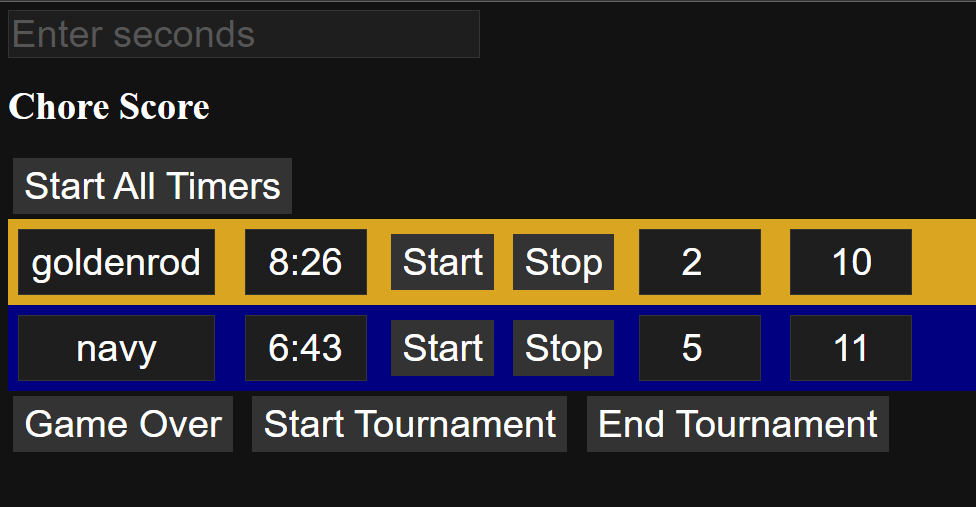

# Scoreboard Project

This project was created to help my kids with their chores. Inspired by Leonard Sachs' book, which discusses how well boys work in teams to earn points, I implemented a team competition strategy. This approach has led to massive improvements in my kids doing chores quickly and well, even when the tasks are not their favorite or they are not as skilled at them.

## How It Works

- Kids are divided into teams.
- The team who gets their chores done the fastest and best wins.
- I hand out prizes to the winning team.

## Timer Buttons

### startAllTimers
Starts the timers for both teams.

### startTimer
Starts the timer for the team.

### stopTimer
Stops the timer for the team.

## How Score is Calculated
The score is calculated based on the minutes taken (rounded down) plus any penalties. Penalties are given for unsportsmanlike conduct while the timer is running. Once the timer is stopped, penalty points are given for anything about the chores that was missed. The team with the lowest score wins.

## Team Name
If you name the teams using a value from CSS named colors (e.g., `Red`, `DarkBlue`, `Orchid`), the back color of the team block will become that color.

## Game Over
Clicking the game over button saves the current score state to the browser cache.

## Tournament Management

### startTournament
Sets a start tournament timestamp in the browser cache.

### endTournament
Sets a tournament `{start, end}` object in the browser cache.

I plan to use this tournament cache to add a leaderboard that shows the game scores since the tournament started.

## To-Do

- Add a leaderboard that keeps track of game outcomes and who's winning the tournament.